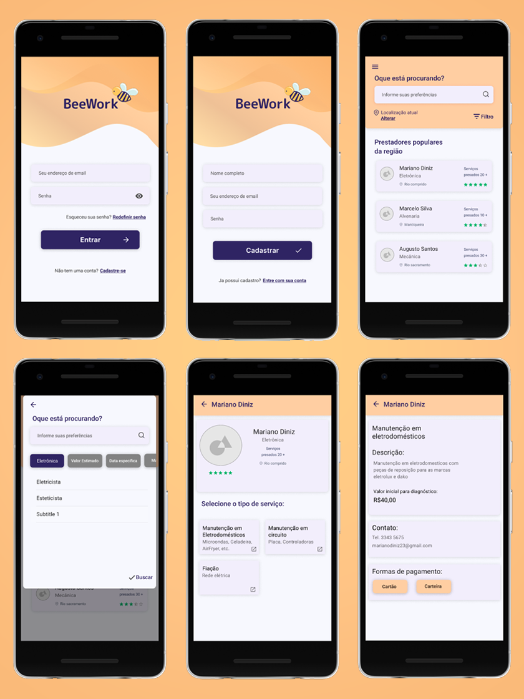

<p align='center'>

</p>

<p align='center'>
  <a href="https://www.android.com/">
    
  </a>
  <a href="https://facebook.github.io/react-native/">
    
  </a>
  <a href="https://nodejs.org/">
    
  </a>
  
  
  
</p>


## Tópicos
* [Sobre](#sobre)
* [Capturas de Tela](#capturas-de-tela)
* [Tecnologias](#tecnologias)
* [Status](#status)
* [Executar a aplicação](#executar-a-aplicação)

## Sobre

A BeeWork :honeybee: busca ser uma opção de mercado voltada para autônomos, com foco direcionado aos pequenos empreendedores.

> Cerca de 41,4% da população brasileira ocupada são de trabalhadores informais. No mundo esse valor chega a 61%.

> A economia informal cresce pelo quinto ano consecutivo, movimentando R$ 1,2 trilhão, o que representa 17,3% do PIB brasileiro. (ETCO, 2019).

Cada vez mais crescem os números de profissionais autônomos, com isso é possível ver o aumento de alternativas de serviços voltados para este público através de aplicativos, sites e redes sociais.

Nossa meta é facilitar o contato entre o prestador e o cliente, deixando tudo de uma maneira simples, sem que sejam necessárias muitas ações para realização da solicitação e atendimento do serviço. 

O diferencial que buscamos, é centralizar os trabalhadores autônomos por região. Disponibilizando para os clientes aqueles serviços que estão próximos, bem pontuados e baratos, que estarão no topo da pesquisa, fornecendo tudo isso em tempo real. O prestador poderá gerar seus próprios cupons de desconto para impulsionar seu negócio.

## Capturas de Tela

<h5 align='center'>Simule o funcionamento do aplicativo no botão abaixo</h5>
<p align='center'>
  <a href="https://www.figma.com/proto/JPzt38fp69GXLC23h20on7/Autonomos?node-id=48%3A95&scaling=scale-down">
    
  </a>
</p>
<p align='center'>  
  
</p>

## Tecnologias
* [Expo](https://expo.io/)
* [Nodejs](https://nodejs.org/)
* [React Native](https://facebook.github.io/react-native/)
* [Typescript](https://www.typescriptlang.org/)

## Status

No momento está disponível apenas o front-end da aplicação.

O backend (API) será desenvolvido em breve.

## Pré-requisitos

Verifique se os requisitos abaixo estão instalados antes de executar a aplicação.

Clique no item para saber mais sobre o processo de instalação.

* [Git](https://git-scm.com/book/en/v2/Getting-Started-Installing-Git)
* [Nodejs](https://nodejs.org/pt-br/download/package-manager/)
* [Expo-cli](https://docs.expo.io/get-started/installation/)
* [Android Studio](https://developer.android.com/studio?gclid=CjwKCAiAouD_BRBIEiwALhJH6PKYb0yrkW_-byOnYSYUkeivxw-BP-PkNOEGCTEnsZmROx5TML7P0hoCBqMQAvD_BwE&gclsrc=aw.ds#downloads) - Caso queira executar o aplicativo em um emulador (recomendado) ao invés do próprio navegador.

## Executar a aplicação
```bash
# Clone este repositório
$ git clone https://github.com/gom-mota/beework.git

# Acesse a pasta do projeto no terminal/cmd
$ cd beework

# Instale as dependências
$ npm install

# Iniciar a aplicação localmente
$ expo start

# irá abrir uma página do Expo no navegador
```

<p align='center'>Copyright :copyright: 2020 - BeeWork</p>